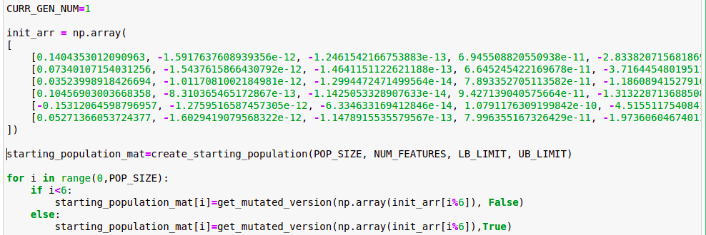
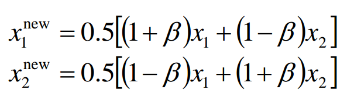

# Application of Genetic Algorithms to find optimal parameters for an unseen dataset

**TEAM ARTIFICIAL BRILLIANCE**

- **ANMOL AGARWAL, RAJ MAHESHWARI**

Genetic algorithms are search techniques used in computing to find true or approximate solutions to optimization and search. It is inspired by Charles Darwin’s theory of natural evolution. This algorithm reflects the process of natural selection where the fittest individuals are selected for reproduction in order to produce offspring of the next generation. It uses techniques inspired by evolutionary biology such as **inheritance, mutation, selection, and crossover.**

Evolution usually starts from a population of randomly generated individuals and happens in generations. In each generation, the fitness of every individual in the population is evaluated, multiple individuals are selected from the current population (based on their fitness), and modified to form a new population.

The new population is used in the next iteration of the algorithm.

**A fundamental difference between applying GA VS the regression based techniques we used in the previous assignment was the switch from calculus based methods to heuristic based methods and the population consisting of multiple points instead of a single member.**

Before we proceed further, we would like to define the terminology we used in the report:

- **Individual -** Any possible solution (in our case, a vector having 11 dimensions)
- **Population -** Group of all individuals of a particular generation
- **Fitness –** Target function that we are optimizing (we keep changing the target function throughout the project depending on what parameter we were trying to optimize that day) and how the genetic algorithm performed with the fitness function
- **Gene:** A particular feature (there are 11 genes in the individual in our case) of the individual
- **Trait -** Possible aspect (features) of an individual
- **Genome -** Collection of all chromosomes (traits) for an individual.
- **Run:** The entire set of generations we ran with the same hyper-parameters

**Our intuitive interpretation of the problem statement wrt to the genetic algorithms context was as follows:**

- We consider each individual of a population as a set of ideas (notions) [not to be considered same as the genes as a particularly useful idea in a given context can be a relation between two genes g1 and g2 rather than there individual values]
- The action of crossover using notions of the individuals (who have been deemed fit for crossover), thus trying to generate new ideas constructed from high performance building blocks (notions) of the past trials.

**High level overview of the steps in our implementation**

- Initialize a starting population
- Determine fitness of population (based on a self-defined heuristic)
- Until improvement is observed, repeat:
    - Select parents from the population fit for mating
    - Crossover parents in mating pool to generate children vectors
    - Perform mutation on new population
    - Calculate fitness for new population

## Our methodology behind running the queries in brief

Over the entire span, we tried to experiment with different heuristics, fitness functions and other parameters.We changed metrics like crossover function, mutation function, population size etc in between generations. [So, all generations in generations1.txt would not have the same size. ]

On each day, we chose some selected vectors from the previous generations and chose them as the initial population. So, the last generation of day ‘x’ does not coincide with the first generation of day ‘x+1’.

In other words, in this graph, consider node ‘i’ to be part of some ‘ith’ run.

Let v1 be part of the population of node 8. Here, the parents of v1 are not from the same generation but are descendants of the overfit vector (in node 1).

As a result, in the generations.txt’s, you will notice that some of our vectors are obtained in generation 3. This implies that this vector was obtained in generation 3 of the run at vertex 8 (on day 3) and the groundwork on this vector began long back in the nodes in the path which lead from node 1 to node 8.

Our methodology for improving performance

The stepwise explanation of our implementation is as follows :

## STEP 1: Generation of the initial population

To start the genetic algorithm, we require a population of some **POP_SIZE** number of individuals.

There were two possible options in front of us when it came to deciding the initial population.

- **Random initialization**
- **Heuristic based initialization** (using some vectors which we thought performed well when ranked on the basis of the decided fitness function[heuristic] and using those to generate the initial population)

We thought that if we use random initialization, it is possible that our exploration space is many times better than the case where we used heuristics based initialization.

On running our first few queries of the project by using random initialization, the results were extremely bad (scaling to errors upto 10^34). We concluded that despite the exploration space being pretty large, using a random initial population could take several amounts of queries to even come remotely close to the error which the overfit vector produced on the train and validation data sets. With our limited requests per day it did not make sense to randomly initialize.

Learning from the above experience, we decided to use the overfit vector as the initial population for our next set of queries. For most of the future runs of our algorithm, we **picked a set of vectors which were obtained during the previous queries and were known to perform well as per the fitness function chosen by us**. We used this set to be a part of and to generate the other members of the initial population.

To make sure that initial population is diverse, we used to do two things:

1. Apply a good amount of mutation on the vectors which were being used to generate the initial population.
2. Made an attempt to pick vectors which are very different from each other in the first place.

So, typically, if the population size was **POP_SIZE**, then we would pick approximately 4-10 good vectors we had previously obtained and mutated them to generate the remaining members of the initial population.

The mutations would typically vary on 2 factors :

- the number of cells (genes) of the origin vector we were going to mutate AND
- the magnitude by which we were going to change the value of that gene. The magnitude of change allowed was usually (alpha x initial value of the gene) where we used to decide alpha depending on what degree of mutation we wanted to apply.

We have ensured that the first generation of individuals is diverse by keeping the probability of mutation factor high, that is the probability with which a gene is mutated in a chromosome is high (usually 70 % chance of a gene being mutated). This is so that the algorithm does not converge to a local minima in the very beginning itself.

## STEP 2: OBTAIN ERRORS FOR THIS GENERATION

Once the first generation is ready, we obtain the errors of all the individuals (parents for the next generation). This is done to determine the fitness of each individual and to decide their progress into the next generation.

A detailed description of the heuristics and fitness functions used by us and their performance can be found in the latter part of the report.

## STEP 3: Determining the parents who would be taking part in reproducing for producing individuals of the next generation and the probability of them doing so

The method we used to select which parents would take part in crossover was the **roulette wheel selection**.

In this method, choosing individuals can be depicted as spinning a roulette that has as many pockets as there are individuals in the current generation, with sizes depending on their probability.

Over the course of the project, we allotted the fraction of the roulette wheel allotted to a particular individual based on the following metrics:

- **Fitness based Russian Roulette:** This fitness level is used to associate a probability of selection with each individual. If f_i is the fitness value of the individual, then its probability of selection would be [NOTE, we try to minimize error fitness and so we use (-fitness) in the below formula

> 

This method has some **shortcomings** which we encountered:

- Firstly, since there is a chance that **fitness values can be negative**, all fitness values must be **scaled by an appropriate factor**, deciding which is a problem on its own. (Eg: 1, 2,3 are not the same as 5,6,7 even though diff between the values are the same). For our implementation, we considered max(over all fitnesses)-fitness of individuals as the numerator for the individual and sum over all numerators as denominator.
- Secondly, consider the case where the fitness values of 3 individuals are (1, 100, 10000000). In this case, as per our implementation, probability of individual 1 would be (9999999)/(9999999+9999900)= 0.500002 and probability for second individual would be (9999900)/(9999999+9999900)=0.499997. So, **despite individual 1 being 100 times better than individual 2, its probability of being selected is approximately the same as individual 2** as individual 3 is so bad that the difference in quality of individuals 1 and 2 seems insignificant.
- **RANK based Russian Roulette:** In order to escape the shortcomings, we switched to rank based russsian roulette where we picked rank individuals on basis of fitness value (the best individual having rank 1) and then for an individual having rank ‘i’, we assign the following probability to it:

> 

Rank-based fitness assignment overcomes the scaling problems of the Fitness based Russian Roulette. The ranking introduced a uniform scaling across the population and provides a simple and effective way of controlling selective pressure.

The spinning of the russian roulette was coded by taking the cumulative sum of the probabilities and choosing the individual in whose bin, a randomly generated number fell.

Due to probabilistic selection of parents, it may happen that the same individual is selected as both parents, in which case the generated offspring will be a copy of the parent.We implemented a check to prevent such unnecessary operations.

## STEP 4: CROSSOVER OF PARENT POPULATION

- Once which parents are to mate is decided, the actual mating process takes place. We experimented with several crossover operators and we describe our observations regarding their performance here.

### Single point crossover

Initially, we implemented a simple single point crossover where the first parent was copied till a certain index, and the remaining was copied from the second parent. It’s disadvantages have been mentioned in the ‘swap crossover’ section.

### BLEND Crossover

Given the two parent genes x1 and x2 (where x1 < x2) , the blend crossover randomly selects a child gene in the range [ x1-α(x2-x1), x2+α(x2-x1)].

### SBX

The entire idea behind simulated binary crossover is to generate two children from two parents.Here, the value of the offspring gene depends on the parent's genes as follows:

Here, Beta is a parameter which is calculated as follows:

**In above, n_c is the distribution index which can be in the range [2,5]. The greater the distribution index, the lesser will be the variation in children as compared to parents. We manipulated the value of n_c based on the extent of exploration we wanted to do in a particular run.**

A small simulation to depict the value of the offspring gene depending on distribution index can be seen below:

### Swap Crossover (designed by us)

We noticed the fact that in all the crossover techniques mentioned above, **either all the genes of two parents intermingle with each other** (SBX, blend crossover) or **always a subset of genes get transferred to the child**. In singlepoint crossover, since from where the child inherits the gene depends on the chosen point, such a case cannot arise where the child inherits genes 1, 4 , 6 from the parent1 and 0,2,3,5,7,8,9 from parent2. We thought **this may be a hindrance as it is possible that the parent1 has its best ideas at features 0 and 11 and child2 has its best features at indexes 4,5 but there is no way that a child inherits 0, 11 from parent1 and 4,5 from parent2**. To take care of this, we implemented a crossover where which indices are to be inherited from a parent are selected randomly in a discrete manner. This helps to **get rid of the role that the permutation ordering** of the genes was playing in other crossovers.

Unsurprisingly, **we got very good results** in terms of the metric we ran this on and we noticed that even though the convergence was slow, there were almost no cases where the child generation had a worse performance than the parent generation.

## STEP 5: Creating the next generation

We retain the few best performing individuals of the previous generation defined by the hyperparameter **RETENTION_RATE** which we varied between the limits [0.2, 0.4]. The parents which are not to be retained were replaced by the newly produced children.

The new generation will have a top (RETENTION_RATE x POP_SIZE) number of parents of the previous generation. This is so that the best (best fitness and least error) chromosomes of both populations are advanced to the next generation. The remaining (1-RETENTION_RATE) x POP_SIZE population of the next generation are filled by the children produced in this generation.

## STEP 6 : Mutation of the genes of the new generation

The aim of mutation is to introduce new genetic material into an existing individual; that is, to add diversity to the genetic characteristics of the population. Mutation is used in support of crossover to ensure that the full range of allele is accessible for each gene.

The mutation of vectors in our code was decided by two hyperparameters:

- **MUT_RATE :** this parameter determined how many of the genes were to be manipulated in the individuals of a generation. In the generation, total number of genes is (POP_SIZE * NUM_FEATURES) where NUM_FEATURES=11 . Now, we chose any [MUT_RATE x (POP_SIZE * NUM_FEATURES) ] of these genes for mutation. As the iterations of the GA proceed, we manipulate this parameter. In case the minimum fitness does not change with passing generations or if avg fitness approaches minimum fitness, we increase this parameter to promote diversity of individuals in next generation,
- **MUT_MAGNITUDE :** Once a gene is selected, this decides by how much magnitude the gene is allowed to be varied. We make sure that the new value of the gene is in the range [ (1-MUT_MAGNITUDE) x old_value , (1 + MUT_MAGNITUDE) x old_value ].When we see that the fitness error is decreasing across generations, we infer that the local minima has still not been reached answer keep this mutation magnitude as low. But as soon as min fitness value does not change across generations, we increase the MUT_MAGNITUDE with the hopes of the new population members being a part of different hills and thus, giving us the chance to explore possibly better local minimas (or a global minima).

**HYPERPARAMETERS**

**NUM_FEATURES=11**

**LB_LIMIT=-10**

**UB_LIMIT=10**

**MAX_ITR=24**

**POP_SIZE=40**

**MUT_RATE=0.3**

**RETENTION_RATE=0.2 # selection rate from prev generation**

**DESC = "[14th March 0.9 x max(t,v) + 0.1 x min(t,v) SBX RUSSIAN ROULETTE]" # For our reference in MongoDB, describes the ‘run’**

Other crossover specific parameters have already been described in the crossover section

- **POP_SIZE :**Initially, we started with approximately a population size of 10 with the aim of exploring different crossover, mutation operators and to see which one is best (With the queries restricted to 500, we wanted to get more iterations under the belt). The population size of around 10 did not lead to any real progress.
- **MAX_ITR :** We usually kept this around 20 and these iterations were enough for us to judge the performance of the fitness function and heuristic we were using. Our implementation was such that we could terminate before MAX_ITR if we see horrible results or run it for > MAX_ITR iterations of results were decent.
- **MUT_RATE :** this parameter determined how many of the genes were to be manipulated in the individuals of a generation. In the generation, total number of genes is (POP_SIZE * NUM_FEATURES) where NUM_FEATURES=11 . Now, we chose any [MUT_RATE x (POP_SIZE * NUM_FEATURES) ] of these genes for mutation. As the iterations of the GA proceed, we manipulate this parameter. In case the minimum fitness does not change with passing generations or if avg fitness approaches minimum fitness, we increase this parameter to promote diversity of individuals in next generation,
- **RETENTION_RATE:** We retain the few best performing individuals of the previous generation defined by the hyperparameter RETENTION_RATE which we varied between the limits [0.2, 0.4]. The parents which are not to be retained were replaced by the newly produced children. Typically, initially we kept a very low retention rate as we wanted a greater exploration space and did not want past vectors (which were possibly not very good, given that we were in the initial stages). But as our results were improved and we wanted vectors (who performed good on the leaderboard) to mate so that the offspring can inherit useful genes from both, we increased RETENTION_RATE with simultaneous increase in POPULATION_SIZE, with hopes of increasing the probability of a champion vector which inherited useful genes from both parents.

# **HEURISTICS APPLIED:**

While constructing the Genetic Algorithm, the heuristics that we applied include :

1. **Implementing a diversity factor in the fitness value:** In the initial stages of our querying, there was a certain point where no improvement was being made. Despite several mutations, the fitness converged close to the same value with the best vectors being similar as was obtained a day before. In order to get out of this big hill we were stuck in, we decided to penalize the children based on how close they were to previous generations parents (we penalized as [gamma] * (min euclidean distance between a parent and the child being tested] ). However, we were not able to find a decent ‘gamma’ value to utilize this idea of ours to get good performance.
2. Variations in mutation value **via simulated annealing (**this did not work for us when we implemented this around 9th March when we were not able to improve our results). This might be due to the fact that due to a high mutation rate initially, we would have been able to reach different hills but due to the limit on the number of queries, we weren’t able to reach close to the local minima of these new hills.
3. **Observation based penalty** in the fitness function (see fitness function 4)

# **Some of the FITNESS FUNCTIONS WE USED**

Over the entire span of the project, we experimented with different fitness functions based on our observations of past queries. Some of them worked and some of them did not. We mention some of them here:

### Fitness function 1:

**Metric:** val - 0.3 x train

**Comments:** Even though we tried several fitness functions before this, this was the first time we made significant progress in reducing the validation error. Logically, this made sense as we were aiming not only to reduce the validation error, but also to remove the overfit on the train error (which would have hindered generalization). So, a negative coefficient of the train error in the initial stages of the project made sense.

### Series of fitness functions 2:

**Metric:** TRAIN_COEFF x train_error + (1-TRAIN_COEFF) x val_error (TRAIN_COEFF was 0.5, 0.7, 0.9)

**Comments:** Courtesy of function 1, we were able to reduce validation error quite well but as a result, train error overshoot to high values which we intended to moderate. So, we ran this on vectors similar to the overfit vector and the vectors obtained in the run of fitness function 1 with hopes of inheriting valuable features from both set of vectors. However, results were just decent and we made minor progress in reducing train error while not compromising on validation error by a huge margin.

### Series of Fitness functions 3:

**Metric: [COEFF_OF_MAX] * max(train, val) + [1-COEFF_OF_MAX] * min(train, val)** where COEFF_OF_MAX was kept as 0.7, 0.8, 0.9, 0.95

**Comments:** With an attempt to keep both training and validation error under control, we implemented this. Heere, we attempt to keep both training and validation errors in check. Some of our best vectors were obtained by these metrics (even though the groundwork for these vectors was done by training our algorithm on functions 1 and 2].

### Fitness function 4:

**Metric:**

fitness_val=0

t=its_fitness_val[0]/(1e10)

v=its_fitness_val[1]/(1e10)

punish = 0

punish += 100 if t < 22 else 0

punish += 100 if v > 17 else 0

fitness_val = t + v + punish

**Comments:** We designed this intuitively keeping in mind that we would want to consider both training and validation errors as useful as far as they do not overfit/underfit. So, the moment validation error went above 17 e10 or training error fell below 22e10, we assigned a penalty to them.

### Fitness function 5:

fitness_val=0

t=its_fitness_val[0]

v=its_fitness_val[1]

punish = 0

punish += 1e11 if (t/v) < 3 else 0

punish += 1e12 if t < 2e11 else 0

punish += 1e12 if v > 1e11 else 0

fitness_val= max(t,v) + punish

**Comments:** We designed this intuitively keeping in mind that we want to keep in check oth train and validation errors while also making sure that the difference in train and validation errors isn’t huge (to make sure that we do not fail to generalize)

We think our vectors are able as some of them have very low errors (of the order of 8e10) on both train and validation set and they also have errors under (100e10) on the test set which was used for leaderboard ranking. Their variations also perform similarly which seems to indicate they haven’t overfitted to specific features of the datasets.

**Diagrams of generations**

**NOTE: If a child has just one parent, that would mean that it is a parent who actually has been retained from the previous generation.**

**The vectors mapping can be found here if needed :** [https://drive.google.com/drive/folders/1H0MU3zvBQjkgznFgLwVExRx79rDh3pVV?usp=sharing](https://drive.google.com/drive/folders/1H0MU3zvBQjkgznFgLwVExRx79rDh3pVV?usp=sharing)

They have also been appended at the end of this doc

### Diagram 1 (corresponds to vec1.txt):

### Diagram 2 (corresponds to vec2.txt):

### Diagram 3 (corresponds to vec3.txt):

### **STATISTICAL INFORMATION of the runs made by our algorithm :**

The statistical information related to each day’s run can be found in the file ‘records.txt’ (contains details of the runs after 28th Feb only [https://docs.google.com/document/d/1tPX1qNchNGkIsrt1NUSff-_pWcawa8RfxrAif7JDb8o/edit#](https://docs.google.com/document/d/1tPX1qNchNGkIsrt1NUSff-_pWcawa8RfxrAif7JDb8o/edit#)

)